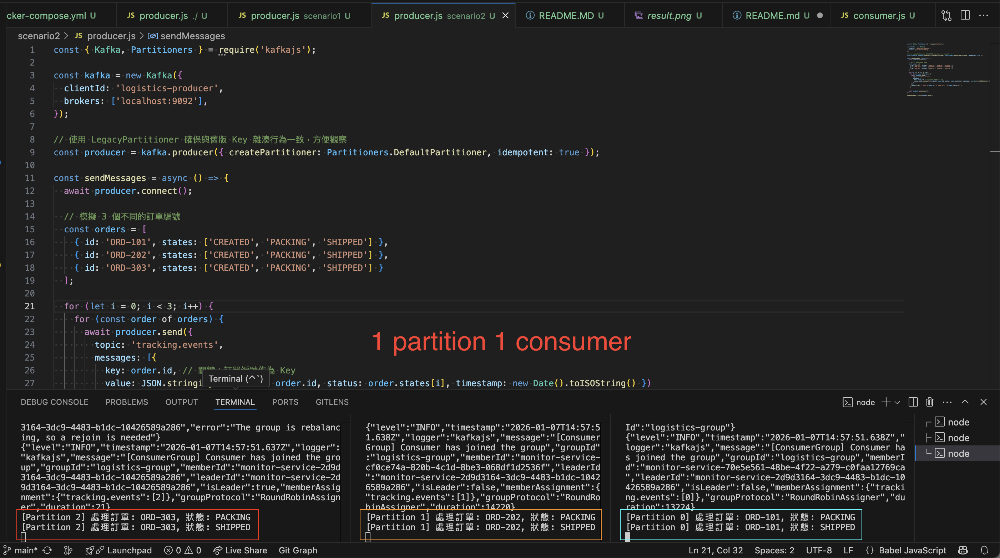

# Test
- Objective: To verify how Kafka balances the workload between multiple consumers.
  - 
  - see [dashboard](http://localhost:8080)
  - `node scenario2/producer.js`
  - `node scenario2/consumer.js`
- Expected Result:
  - Check your console output. You should see different Consumer IDs claiming different partitions:
  - **Terminal A:** `Consumer 1 started. Assigned partitions: [0]`
  - **Terminal B:** `Consumer 2 started. Assigned partitions: [1]`
  - **Terminal C:** `Consumer 3 started. Assigned partitions: [2]`