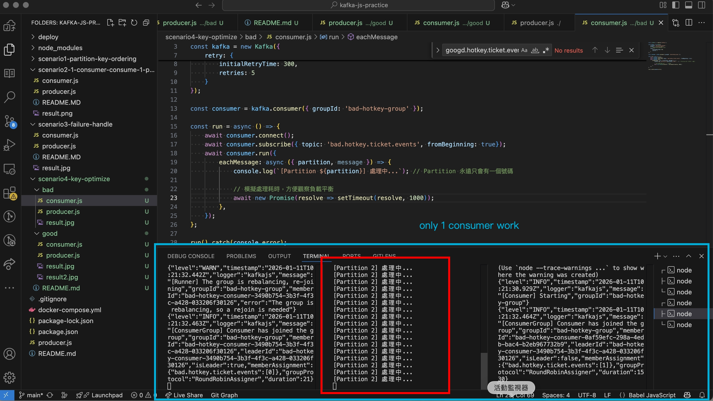

# 🧪 Scenario 4: Hot Key Optimization via Key Salting

## 📌 Background: The "Hot Key" Problem
In high-concurrency systems like ticket booking, using a single resource ID (e.g., `concert_id`) as the Kafka message key is an intuitive but flawed design. Because Kafka maps keys to specific partitions, a popular event (Hot Key) will cause **Partition Skew**.

* **Symptoms**: One partition is overwhelmed with millions of messages while others remain idle.
* **Consequence**: You cannot scale by adding more consumers, as only one consumer can process a single partition at a time.

---

## 🔬 Experiment Setup
We compared two producer strategies sending 1,000 ticket requests for the same concert to a topic with **3 partitions**.

### 1. Bad Design: Single Fixed Key
* **Directory**: `scenario4-key-optimize/bad/`
* **Strategy**: Every message uses `key: 'SUPER_STAR_CONCERT_2026'`.
* **Result**: All 1,000 messages land in **Partition 2**.
* **Consumer Performance**: Only 1 consumer works; others in the group are idle.
* **implements**
  - `node ./bad/producer.js`
  - `node ./bad/consumer.js`
  - see [dashboard](http://localhost:8080)
* **resultss**
  - 
  - 
### 2. Good Design: Key Salting
* **Directory**: `scenario4-key-optimize/good/`
* **Strategy**: Appends a random suffix (Salt) to the key: `key: 'SUPER_STAR_CONCERT_2026' + '_' + random(0, 2)`.
* **Result**: Messages are distributed evenly across **Partition 0, 1, and 2**.
* **Consumer Performance**: 3 consumers can work in parallel, tripling the throughput.
* **implements**
  - `node ./good/producer.js`
  - `node ./good/consumer.js`
  - see [dashboard](http://localhost:8080)
* **resultss**
  - 
  - 

---

## 📊 Comparison & Results

| Metric | Bad Design (Fixed Key) | Good Design (Key Salting) |
| :--- | :--- | :--- |
| **Partition Distribution** | Heavily Skewed (Single Partition) | Evenly Balanced |
| **Consumer Parallelism** | **1** (Rest are idle) | **N** (Up to partition count) |
| **Throughput** | Bottlenecked by single consumer | Scalable with consumer group |
| **Message Ordering** | Strictly Guaranteed | **Lost** (Across the same concert) |

---

## ⚖️ Pros and Cons Analysis

### ✅ Advantages of Key Salting
* **High Scalability**: Allows the system to handle millions of requests for a single "Hot" event by leveraging the entire cluster's power.
* **Resource Efficiency**: Prevents "Idle Consumer" syndrome where CPU/Memory is wasted on nodes that aren't assigned any partitions.
* **System Stability**: Reduces the risk of a single broker node crashing due to localized disk or network I/O pressure from a hot partition.

### ❌ Disadvantages & Trade-offs
* **Loss of Order**: Messages for the same concert are no longer guaranteed to be processed in the exact order they were produced.
* **Downstream Complexity**: The business logic (e.g., inventory deduction) must now handle concurrency. You cannot rely on Kafka's sequential processing to prevent "over-selling."
* **Compensation Required**: Typically requires a distributed lock (e.g., Redis Lua script) or database-level constraints (Optimistic Locking) to manage shared state.

---

## 💡 Engineering Insight
> "In this scenario, I demonstrated that **Scalability is often a trade-off with Strict Ordering.** For a ticketing system, horizontal scale is non-negotiable to prevent system collapse during peak traffic. By implementing **Key Salting**, I broke partition affinity to achieve maximum throughput. I understand that this shifts the consistency responsibility to the database layer, which is a standard pattern for high-load event-driven architectures."