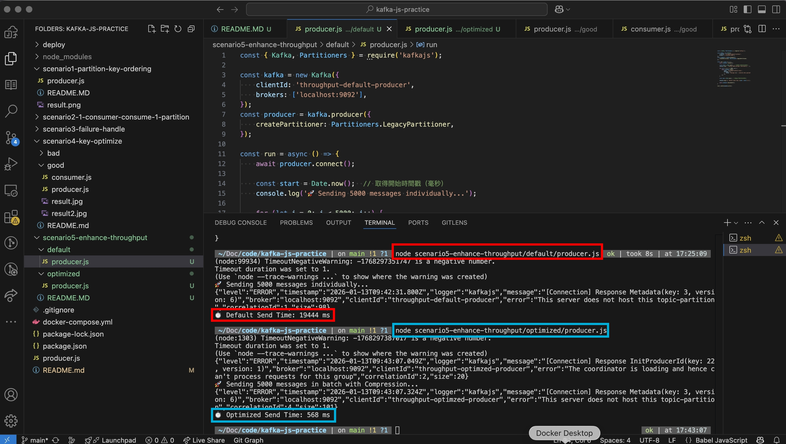

## Implement
- `node ./default/producer.js`
- `node ./optimized/producer.js`
- 

## 📊 Performance Comparison Results

| Metric | Default Strategy (Single Send) | Optimized Strategy (Batch + Gzip) |
| :--- | :--- | :--- |
| **Logic** | `await` inside a for-loop | `push` to array, then single `send` |
| **Network Calls** | 5,000 individual RTTs | 1 bulk RTT (with compression) |
| **Total Time (ms)** | ~19,444 ms | ~568 ms |
| **Efficiency Gap** | **Baseline** | **~30x Performance Gain** |

---

## 💡 Why Batching + Compression Matters?

1. **Reduced Round-Trip Time (RTT)**:
   In the "Bad" example, the code waits for Kafka's acknowledgment 5,000 times. In the "Good" example, we only wait once.

2. **CPU & IO Efficiency**:
   Compressing a batch is far more efficient than compressing individual small messages. It significantly reduces the size of data written to the broker's disk.