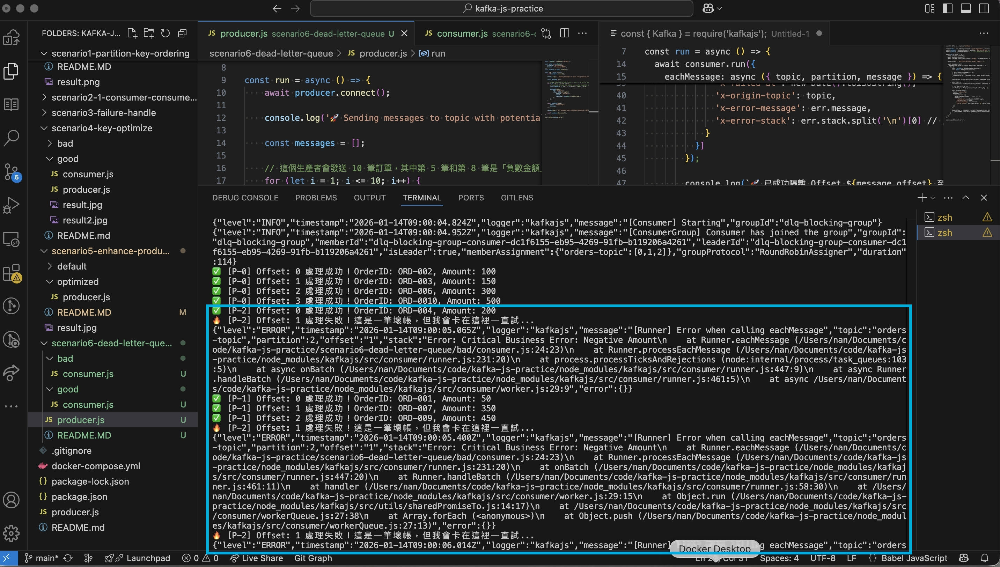
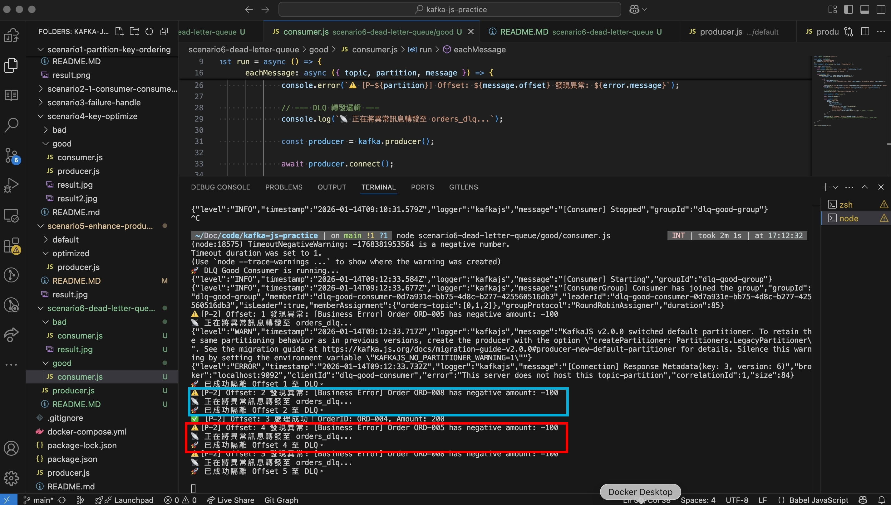

# 🧪 Scenario 6: Dead Letter Queue (DLQ) & Resilience Patterns

## 📌 Background: The Poison Pill Problem
In event-driven systems, a **Poison Pill** is a message that can never be processed successfully due to corrupted data or logic errors.
* **The Risk**: Without a DLQ, the consumer will trigger an infinite retry loop (as seen in Scenario 3), leading to **Head-of-Line Blocking**. This stalls the entire partition, preventing valid messages from being processed.

---

## 🔬 Experiment: Blocking vs. Isolation
We simulated a scenario where 20% of orders have invalid data (negative amounts).

### 1. Bad Design: Infinite Retry (Blocking)
* **Behavior**: The consumer `throws` an error upon detecting invalid data.
* **Result**: The partition is stuck. The consumer repeatedly attempts to process the same failing offset.
* **Observation**: Consumer Group **Lag** grows indefinitely for that partition.
* **Implement Result**: 

### 2. Good Design: DLQ Pattern (Isolation)
* **Behavior**:
    1. Catch business logic errors via `try...catch`.
    2. Produce the failing message to a dedicated `orders_dlq` topic with error metadata in headers.
    3. **Commit the original offset** and proceed to the next message.
* **Result**: The system remains healthy. Bad messages are isolated for manual inspection.
* **Implement Result**: 

---

## 📊 Comparison: When to Retry vs. When to DLQ

| Error Type | Example | Recommended Action |
| :--- | :--- | :--- |
| **Transient** | DB Timeout, Network Glitch | **Retry** (Wait and try again) |
| **Permanent** | Schema Mismatch, Negative Amount | **DLQ** (Isolate and move on) |

---

## ⚠️ Critical Architecture Insights

### 1. Message Immutability
Messages are **NOT deleted** from the original topic when "moved" to a DLQ.
* Kafka logs are immutable. We simply produce a copy to the DLQ and advance the consumer's offset in the original topic.
* This preserves the **Audit Trail** in the source topic, allowing for future debugging or re-processing.

### 2. The Sequential Workflow Dilemma (e.g., Payments)
In state-sensitive workflows (Order Created → **Paid** → Shipped), using a DLQ to "skip" a failed step may break downstream logic.

**Two Strategies for Sequential Failures:**

* **Strategy A: Blocking Strategy (Stop on Error)**
    * **Action**: Do NOT use `try-catch` for DLQ. Let the consumer retry and trigger alerts.
    * **Pros**: Prevents logic disasters (e.g., shipping without payment).
    * **Cons**: Blocks the partition, affecting other users in the same partition.
    * **Best For**: High-integrity internal financial systems.
* **Strategy B: Logic Marking (State Check)**
    * **Action**: Catch the error, mark the Order as `FAILED` in the database, and proceed. Subsequent steps (e.g., Shipping) must check the DB state and skip if the order is failed.
    * **Pros**: High throughput; does not block Kafka partitions.
    * **Best For**: High-concurrency systems like ticketing or e-commerce.

### 3. Kafka & Sequential Operations
Kafka requires specific design patterns to ensure correctness:

1.  **Idempotent Producer**: Ensures messages are not duplicated during retry at the producer level.
2.  **Transactional Outbox Pattern**: Ensures the Database update and Kafka message production are an **Atomic** operation (This is our focus in **Repo 2**).
3.  **State Validation**: Consumers must verify the "Pre-condition State" in the database before executing the current message logic.

### 4. DLQ Robustness
The DLQ mechanism itself must be fail-safe. During our experiment, we observed that a `ReferenceError` (e.g., typos like `messsage`) inside the `catch` block will still crash the consumer. The infrastructure for error handling (producers, connections, variable naming) must be as stable as the main business logic.

---

## 💡 Engineering Insight
> "Implementing a DLQ is not just about error handling; it's about **System Observability.** By siphoning failures into a dedicated topic, we decouple 'System Stability' from 'Data Quality Issues.' This allows the engineering team to fix bugs and replay messages without impacting the real-time production traffic."

---

### 🚀 Next Steps: Towards Repo 2
We have mastered the core mechanics of Kafka. However, we still face the **"Dual Write"** problem: *What if the Database updates but the Kafka produce fails?* **Next Project: Repo 2 - The Transactional Outbox Pattern.**